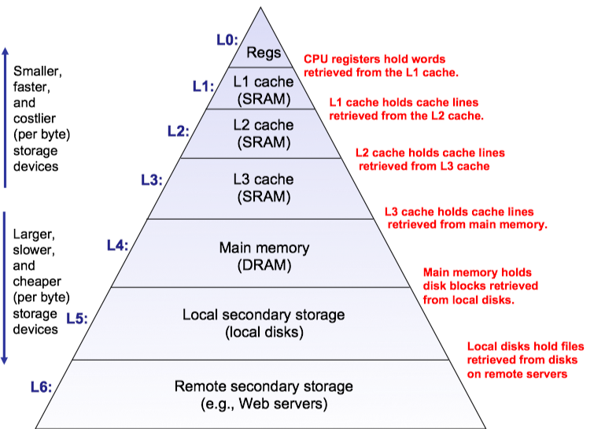

# 3 存储器（@苏阳）

## 3.1 什么需要Cache

程序一般有一定特点：指令和数据分别都有**时间相关性**和**空间相关性**。

-   时间相关性：时间相关性指的是指令或数据在时间上的相邻性，即某个时间点访问的指令或数据很可能在不久之后再次被访问。

    -   指令的时间相关性：在程序执行过程中，循环结构是造成指令时间相关性的主要原因。例如：

        ```c
        for (int i = 0; i < 10; i++) {
            sum += array[i];
        }
        ```

        在这个循环中，循环体的指令会被多次执行，从而体现出强烈的时间相关性。处理器可以利用指令缓存（instruction cache）来存储这些频繁访问的指令，从而减少从主存加载指令的时间，提高执行效率。

    -   数据的时间相关性：数据的时间相关性指的是某个数据在被访问后，可能在短时间内再次被访问。例如：

        ```c
        int a = array[5];
        array[5] = a + 1;
        ```

        在上述代码中，`array[5]`在短时间内被多次访问。数据缓存（data cache）可以存储这些数据，以加快访问速度。

-   空间相关性：空间相关性指的是在存储器中的相邻位置的数据或指令很可能在相近的时间被访问。

    -   指令的空间相关性：在程序执行过程中，指令通常是顺序存储和顺序执行的。例如：

        ```c
        int a = 1;
        int b = 2;
        int c = a + b;
        ```

        这些指令在存储器中是顺序存储的，处理器会顺序读取这些指令执行，从而体现出空间相关性。指令缓存可以一次加载多条顺序存储的指令，提高指令的预取效率。

    -   数据的空间相关性：数据的空间相关性指的是相邻存储位置的数据很可能在相近的时间被访问。例如：

        ```c
        for (int i = 0; i < 10; i++) {
            sum += array[i];
        }
        ```

        在这个循环中，数组`array`中的相邻元素会被顺序访问，从而体现出数据的空间相关性。数据缓存可以利用这一点，通过一次加载多个相邻的数据来提高访问速度。

存储器的“访问速度”的提升速度要慢于处理器的“访问速度”的提升速度。一般而言，从高层往低层走，存储设备变得更慢、更便宜和更大。

-   在最高层(L0)，是少量快速的CPU寄存器，CPU可以在一个时钟周期内访问它们。
-   接下来是一个或多个小型到中型的基于SRAM的高速缓存存储器，可以在几个CPU时钟周期内访问它们。
-   然后是一个大的基于DRAM的贮存，可以在几十到几百个时钟周期内访问它们。
-   接下来是慢速但容量很大的本地磁盘。
-   最后，有些系统包括了远程服务器上的磁盘，要通过网络来访问它们。



因此，如果将程序信息保存在Cache里，那么根据局部性原理，接下来的程序访问大概率能在Cache种取得数据，就无需访问memory，这样能减少memory阻塞流水线运行的情况。那么Cache是什么？广义的Cache可以认为L~n-1~就是L~n~的Cache，如DDR就是磁盘或flash的Cache，L2 Cache可以看作是DDR的Cache，L1看作是L2的Cache。这里先约定下，后面所说的Cache，主要指处理器内部的Cache，即DDR的Cache。


## 3.2 Cache的一般设计

### 3.2.1 Cache的组成

缓存（Cache）结构由标签（Tag）和数据（Data）两部分组成。数据部分存储实际的数据，而标签部分存储数据块的部分地址信息。

在缓存访问过程中，通过地址查找数据。由于缓存容量有限，不同地址可能映射到缓存中的同一区域。地址中的索引（Index）决定了地址映射到缓存的哪个集合（Set）。

一个集合内可能包含多个缓存行（Cache Line），为了选出所需的缓存行，地址中的部分比特作为标签（Tag），通过标签比较选出合适的缓存行。因此，缓存查找是否命中是由标签和索引共同决定的。


一个缓存行（Cache Line）通常设计得较大，而我们在一次数据读取时可能不会按照缓存行对齐的方式读取数据。这时，地址的剩余部分（即word和byte偏移）用于索引缓存行中的具体数据位。

理解了上述概念后，缓存的实现方式就更容易理解了。上述描述的是经典的组相联缓存（Set-Associative Cache）。组相联缓存有两种特殊情况：

1. **直接映射缓存（Direct-Mapped Cache）**：每个内存地址唯一映射到一个缓存行（way=1）。
2. **全相联缓存（Fully Associative Cache）**：所有缓存行组成一个集合（set=1），可以认为没有索引，直接根据标签逐内容比较，因此也称为内容地址存储器（Content Address Memory，CAM）。

标签比较过程可能耗时较多。从性能角度来看，三种缓存的优劣排序如下：

- 直接映射缓存 > 组相联缓存 > 全相联缓存

然而，从热数据保持能力角度来看，情况恰好相反：

- 全相联缓存 > 组相联缓存 > 直接映射缓存

这是因为缓存替换总是从集合中选取被替换者，对于way=1的缓存，替换频率较高，不利于热数据的保持。

### 3.2.2 Cache的写入

指令缓存（I-cache）是只读的。若需要修改指令，修改操作通过数据缓存（D-cache）写入到L2缓存，并将I-cache中的相关指令无效化，称为清理（clean）。处理器执行时使用修改后的指令。以下内容针对D-cache进行讨论。

写操作必须保证D-cache和下级缓存的一致性。写直达（write-through）方法将数据同时写入D-cache和下级缓存，但由于下级缓存访问时间长且store指令频繁，执行效率会显著降低。写回（write-back）方法将被写入数据的缓存行标记为“脏”状态（dirty），在其被替换时再写入下级缓存，这会增加存储器一致性管理的复杂性。

写缺失（write miss）可以通过非写分配（non-write allocate）或写分配（write allocate）处理。非写分配将数据直接写入下级缓存；写分配则先将数据块从下级缓存搬到D-cache，再进行修改。通常，写直达策略配合非写分配，而写回策略配合写分配。

### 3.2.3 Cache替换策略

在缓存系统中，无论是读操作还是写操作，都涉及到从缓存集合（cache set）中选择一个缓存行（cache line）来存放从下级缓存中读入的数据。当缓存集合已满时，需要进行替换。本节将介绍两种最常用的替换算法，分别如下：

1. **近期最少使用**（Least Recently Used, LRU）算法：LRU算法为每个缓存行设置一个年龄（age）部分。当一个缓存行被使用时，其对应的年龄值增加或减小其他缓存行的年龄值，从而选择年龄值最小的缓存行进行替换。然而，随着缓存相关度（即way数）的增加，精确实现LRU的代价变得昂贵。因此，**伪LRU**（Pseudo-LRU）算法被提出作为替代。伪LRU算法将所有way进行分组，每组使用一个1位的年龄位。

2. **随机替换**（Random Replacement）算法：随机替换算法虽然缺失频率较高，但随着缓存容量的增加，其缺失率会有所缓解。随机替换通过**时钟算法**实现，其本质是一个计数器，每周期加1。对于8个way的缓存，需要一个3位的计数器，通过计数值选择对应的way进行替换。该算法在硬件上的实现复杂性较低。

### 3.2.4 流水线设计

Cache流水线一般有两种组织形式：

1. **并行访问**：在这种组织形式中，标记（tag）和数据（data）分开称为tag SRAM和data SRAM。标记读取的同时，数据也被读取并送到多路选择器，该选择器由标记比较结果控制，选择合适的数据块，再根据偏移量（offset）进行数据对齐，即选择合适的字或字节。由于Cache访问是处理器的关键路径，这种方法会带来较大的延迟。虽然指令缓存（I-cache）可以通过流水线实现每周期读取一条指令的效果，但数据缓存（D-cache）会增加load指令的延迟。并行访问设计导致较低的时钟频率和较高的功耗，但由于减少了一个时钟周期的访问过程，更适合顺序超标量处理器。
2. **串行访问**：这种组织形式首先通过索引访问tag SRAM，读取出的标记与地址中的标记进行比较。通过匹配的标记，只访问指定的SRAM，这时索引可以定位到匹配的数据块，然后通过偏移量访问字节数据。由于不需要访问所有的data SRAM，只需读取匹配的那一个，这种方法降低了功耗。然而，由于串行执行，延迟增加。尽管增加了一个时钟周期，但这种设计实现了更高的时钟频率，并不会显著降低性能，因此更适用于乱序超标量处理器。

总的来说，并行访问导致较低的时钟频率和较高的功耗，但减少了一个时钟周期的访问时间，更适合顺序超标量处理器；而串行访问则通过增加一个时钟周期实现更高的时钟频率，不会显著影响性能，更适合乱序超标量处理器。

## 3.3 虚拟存储

- 本节主要介绍虚拟存储器的带来的问题与解决方式

### 3.3.1 为什么需要虚拟存储

虚拟存储器优点总结如下：

1. 让每个程序都有独立的遍及全部虚拟地址范围的地址空间，而且可以对程序进行保护和共享，直接使用物理地址需要在编写程序时对地址进行限制且难以保护及共享；
2. 可将不连续PA空间映射为连续的VA空间，减少碎片，最大限度利用物理内存；
3. 为多个进程分配的物理内存之和可能大于实际物理内存，但实际为进程分配的只是虚拟存储器的页，可存于物理内存或下一级硬盘中（硬盘中这部分空间称为swap空间），需要用到swap空间的页时再进行加载；
4. 利用虚拟存储器可管理每个页的访问权限，单纯物理内存不具备权限属性，而操作系统要求在物理内存中实现不同的访问权限，权限管理可通过在页表中设置每页的属性来实现，操作系统和MMU可由此控制每页的访问权限。

### 3.3.2 地址翻译

#### 3.3.2.1 单级页表

在计算机系统中，地址映射是一个关键过程。我们通常会想到一种方法，即通过虚拟地址查询一个表，然后根据查询到的表项确定虚拟地址映射到的物理地址。这种方法引出了几个问题：

1. 页表的位置：这个表就是页表（Page Table，PT）。由于页表的表项数量通常较多，将其存储在寄存器中并不现实。例如，如果每个表项对应4KB内存，那么4GB内存就需要约1M个表项。因此，页表一般放置在物理内存中。

2. 页表的内容和空间需求：页表需要存储哪些内容？它们占用多大空间？让我们继续以4KB粒度的映射、32位地址总线、2GB物理内存为例。一个表项至少需要包括19位（2GB/4KB）来表示物理地址的页帧号（Page Frame Number，PFN），还需要1位来表示该表项是否有效（即该地址内容是否已加载到内存）。这样计算，页表至少需要1M个表项，每个表项20位，即总共需要2.5MB的存储空间。实际上，由于页表放在物理内存中，表项的大小通常是32位，其中多余的位用于存储内存属性等信息。这样计算，一个页表需要约4MB连续的物理地址空间。对于64位宽的虚拟地址空间，页表的大小将会更加庞大。

3. 多进程环境中的页表：在多进程环境中，每个进程都需要一套独立的页表，以实现虚拟地址的隔离。不同进程的页表可以相互独立，也可以实现共享地址空间。例如，共享库的地址空间可以在多个进程之间共享，这样可以节省内存空间并提高效率。

总的来说，页表是实现虚拟内存管理的核心组件之一。虽然其管理和存储带来了复杂性和开销，但通过合理的设计和优化，可以有效提高系统的性能和资源利用率。本节讲述的即为单级页表，又称线性页表。

#### 3.3.2.2 多级页表

在多级页表（multi-level page table）中，线性页表被分解成若干子页表，根据需要逐步加载这些子页表。相邻的子页表可以放置在不连续的位置，因此需要一个第一级页表来记录子页表的位置，这些子页表被称为第二级子页表。

**地址转换过程**

在多级页表结构中，获取物理页号（Physical Frame Number，PFN）需要依次访问两级页表，才能最终访问实际数据。页表中的每个表项称为页表项（Page Table Entry，PTE）。在创建进程时，操作系统最初在物理内存中分配4KB的连续空间来存放一级页表，并将一级页表的起始地址存储在页表寄存器（Page Table Register，PTR）中。随着进程的执行，操作系统逐步创建二级页表，并将其起始地址存放在一级页表的相应表项中。

虚拟地址通常由多个部分组成，例如p1、p2和偏移量。具体而言：

- **p1**：表示虚拟地址的高位部分，用于索引一级页表。
- **p2**：表示虚拟地址的中间部分，用于索引二级页表。

当虚拟地址的p1部分发生变化时，需要创建一个新的二级页表。当p2部分发生变化时，表示需要访问一个新的页。在这种情况下，必须从次级存储器中获取所需的页并将其加载到物理内存中，然后将该页的起始地址填入相应二级页表的PTE中。除非虚拟地址分布极其分散（跨越所有页面），这种方法可以显著节省页表的存储空间。一级页表占用的4KB空间在程序运行期间是不可避免的，只有在程序终止时才会释放。

**需求分页**

只有在需要的时候才将一个页加载到物理内存中，这种方式称为需求分页（demand paging）。操作系统逐步创建二级页表的过程也可以称为需求分页。多级页表结构简单，易于通过硬件实现页表查找，因此许多支持页表遍历（page table walk）的处理器在发生TLB缺失时采用多级页表结构进行查找，并将映射关系写回TLB。随着处理器位数的增加，可以通过扩展页表的级数来减小页表对物理内存的占用。

**多级页表的优缺点**

多级页表的主要优点在于其能够显著节省页表的存储空间，并且具有良好的扩展性。然而，其缺点在于增加了物理内存的访问次数。例如，对于二级页表，需要访问三次内存才能获取数据。为了解决这一问题，现代处理器使用TLB和缓存来加快地址转换过程。后续章节将详细介绍这些加速机制。

总之，多级页表在现代计算机系统中发挥着重要作用，通过合理的设计和优化，可以在保证高效地址转换的同时，显著降低页表存储的开销。

### 3.3.3 TLB设计

物理内存的访问速度与处理器的速度存在数十倍的差距。由于两级页表结构需要访问两次物理内存才能获得物理地址，因此需要使用缓存来存储最近使用的页表项（PTE），这一缓存被称为翻译后备缓冲区（TLB, Translation Lookaside Buffer）。TLB作为页表的缓存，具有时间相关性，但空间相关性较弱，即不一定会访问当前页的相邻页，因此预取等方法无法应用于TLB中。现代处理器通常采用两级TLB结构，其中第一级TLB采用哈佛结构，分为指令TLB（I-TLB）和数据TLB（D-TLB），并且均采用全相联映射；第二级TLB则指令和数据共用，采用组相联映射。

下表展示了一个全相联TLB的内容。valid位为1表示命中，即可以直接从TLB中获取物理帧号（PFN），否则需要访问物理内存中的页表。在这种情况下，找到的PTE还需要检查其valid位，如果为1，则从页表中获取PFN并访问相应的物理内存以获取数据，同时将该PTE写回TLB；否则会产生页错误（page fault），操作系统需要将对应的页调入物理内存，并将其首地址写入PTE中，同时将该PTE写回TLB。

| Cacheable | AP   | Valid | Dirty | Use  | VPN  | PFN  |
| --------- | ---- | ----- | ----- | ---- | ---- | ---- |
| 1         |      | 1     | 1     | 1    |      |      |
| 1         |      | 1     | 0     | 1    |      |      |
| 1         |      | 1     | 0     | 1    |      |      |
| 0         |      | 1     | 0     | 1    |      |      |

TLB 表项的各内容含义如下：

- **Cacheable**：表示该页是否可缓存。若设置为1，则该页可以存储在高速缓存中，从而加快访问速度；若设置为0，则该页不允许缓存。
- **AP（Access Permissions）**：访问权限。定义了该页的访问权限，包括读、写、执行权限等。这有助于保护内存区域，防止未经授权的访问。
- **Valid**：有效位。表示该表项是否有效。若设置为1，则表明TLB中该表项有效，可以用于地址转换；若设置为0，则该表项无效，需要访问页表来进行地址转换。
- **Dirty**：脏位。表示该页是否被修改过。若设置为1，则表明该页自从加载到内存以来已经被写入过，需要在替换时将其写回磁盘；若设置为0，则该页未被修改过，不需要写回磁盘。
- **Use**：使用位。表示该页是否被使用过。通常用于页替换算法，如LRU（最近最少使用），以决定哪些页可以被替换。
- **VPN（Virtual Page Number）**：虚拟页号。表示虚拟地址中的页号部分，用于索引TLB以查找对应的物理页号。
- **PFN（Physical Frame Number）**：物理帧号。表示物理内存中的帧号，是实际的物理地址的一部分，结合页内偏移（offset）可以得到完整的物理地址。

在现代处理器中，通常支持由操作系统管理的可变大小的页，以便根据不同应用选择适当的页大小，从而最大限度地利用TLB。因此，TLB 需要相应的页掩码（pagemask）来标识页的大小。需要注意的是，不同页大小的虚拟页号（VPN）位数不同。此外，TLB 的寻址还受到地址空间标识符（ASID）和全局位（global bit）等因素的影响。

在TLB中，除使用位和脏状态外，其他项均为只读属性。当TLB命中时，将使用位（use）置为1；在执行存储操作时，仅需将脏位（dirty）置为1。因此，TLB 采用写回方式时，仅需将使用位和脏位写回页表。这种设计简化了TLB 的管理，并提高了其效率。

#### 3.3.3.1 TLB缺失

由于翻译后备缓冲区（TLB, Translation Lookaside Buffer）容量有限，TLB缺失经常发生。TLB缺失主要有两个原因：虚拟地址（VA, Virtual Address）对应的页面不在物理内存中，或该页面的页表项（PTE, Page Table Entry）不在TLB中。解决TLB缺失的本质是从页表中找到映射关系并写回TLB，这一过程称为页表遍历（page table walk）。这一过程可以通过软件或硬件状态机实现，其各自的工作流程如下：

**软件实现**

软件实现提供了使用各种TLB替换算法的灵活性，但需要硬件支持以降低复杂性。在这种方法中，硬件将导致缺失的VA保存到一个特殊寄存器中，并触发TLB缺失异常，转移控制到异常处理程序。异常处理程序使用保存的VA寻址物理内存中的页表，找到相应的PTE并将其写回TLB。显然，处理器需要支持直接读写TLB的指令。异常处理程序是操作系统的一部分，位于不需要地址转换的区域，直接使用物理地址进行指令获取和数据访问，避免处理程序再次发生TLB缺失。如果发生页面错误（page fault），可能会导致嵌套异常。

**硬件实现**

在硬件实现中，当检测到TLB缺失时，内存管理单元（MMU, Memory Management Unit）会自动使用VA寻址内存中的页表。这涉及一个逐级查找页表的状态机。一旦找到有效的PTE，它会将PTE写回TLB，而不需要任何软件干预。然而，如果发生页面错误，必须由软件处理。

**性能影响**

软件处理方法降低了硬件复杂性，而硬件处理会在等待MMU解决缺失期间暂停流水线。即使是乱序执行，流水线也必须暂停以等待MMU完成任务。从延迟角度来看，软件处理包括异常处理程序的时间和状态恢复时间，而硬件处理仅包括MMU处理导致的流水线暂停时间。MMU硬件寻址时间通常略少于异常处理程序时间。此外，处理异常需要清除流水线，并从发生异常的地方重新获取指令。异常处理通常在流水线末尾进行，以确保实现精确异常处理。

从页表中检索PTE需要若干个周期，如果PTE不在内存中则需要数百个周期。TLB缺失的频率取决于TLB的大小、关联度、页大小、页和PTE的替换算法，以及页面是否为脏状态等因素。PTE替换通常采用时钟计数或随机算法。

#### 3.3.3.2 TLB写入

由于TLB的存在，页表中记录的使用位（use bit）和脏位（dirty bit）可能会过时。然而，在发生页面错误时，无需将所有TLB表项的状态位写入页表，因为这样会耗费大量时间。操作系统可以通过特定的方法记录哪些页表项（PTE, Page Table Entry）已被加载到TLB中，从而仅替换不在TLB中的页，避免在替换页时检查其是否记录在TLB中，否则还需在TLB中将其置为无效。

当操作系统需要替换内存中的页时，必须检查该页是否处于脏状态。实际上，每个页的最新内容可能存储在数据缓存（D-cache, Data Cache）中，因此在进行页替换时，首先需要确认D-cache中是否保留着该页的数据。由于D-cache中的数据未必在TLB记录的范围内，如果数据被保留，则需将其写回物理内存。这要求操作系统具备控制D-cache的能力。

#### 3.3.3.3 TLB控制

TLB的内容必须是页表的子集，而操作系统在以下情况下会抹掉某些页的映射关系，注意这些关系在TLB中也不应存在：

1. **进程结束时**：该进程的指令、数据和堆栈所占据的页表均需变为无效，即释放所占用的物理内存空间，TLB中相应的PTE也要置为无效。如果没有使用地址空间标识符（ASID），需将指令TLB（I-TLB）和数据TLB（D-TLB）中全部内容置为无效，以保证新进程得到干净的TLB；如果使用ASID，则只需清除此进程对应的内容。
2. **进程占用物理内存过大时**：操作系统可能会把不常用页写回硬盘，也需将TLB中对应内容清除，但一般会避免清理TLB中对应页，因为这些页可能会被继续使用。

因此，TLB的管理包括能够对以下内容进行无效化操作：

- **I-TLB和D-TLB中全部表项**
- **ASID对应的所有表项**
- **某虚拟页号（VPN）对应的表项**

不同处理器对TLB的管理方法各异。本文以LoongArch处理器为例进行说明。

#### 3.3.3.4 LoongArch的TLB控制

LoongArch指令集架构（ISA）专门设计了一组指令用于直接控制TLB，这些指令允许软件对TLB进行高效管理和操作。假设TLB中有多个表项，其具体实现可能采用全相联或组相联结构。LoongArch提供了一套完整的指令集用于处理TLB操作，包括TLB插入、删除、查询和刷新等功能。

**TLB插入与更新**

在LoongArch中，TLB插入与更新指令用于将新的页表项插入到TLB中或更新现有的表项。通常，这些操作通过以下步骤完成：

1. **准备页表项数据**：页表项的数据，包括虚拟页号（VPN）和物理帧号（PFN），首先被加载到特定的寄存器中。
2. **执行TLB插入指令**：使用特定的TLB插入指令（如`tlbwr`），将寄存器中的页表项数据写入到TLB中。如果TLB采用随机替换策略，则可以使用类似`tlbfill`的指令。

**TLB删除与刷新**

对于TLB删除与刷新操作，LoongArch提供了相应的指令：

1. **TLB删除指令**：通过指定要删除的页表项，使用`tlbclr`指令来移除特定的TLB表项。
2. **TLB刷新指令**：为了确保一致性，系统可能需要刷新整个TLB或部分TLB，这通常通过`tlbflush`指令完成。该指令可以清除TLB中的所有表项或特定范围内的表项。

**TLB查询与诊断**

LoongArch还提供了TLB查询与诊断指令，允许软件检查TLB的状态和内容：

1. **TLB查询指令**：通过指定虚拟地址，使用`tlbsrch`指令来查询TLB是否包含特定的页表项，并将查询结果存储在指定的寄存器中。
2. **诊断与调试**：为了进行性能分析和故障排除，LoongArch提供了诊断指令，使得软件可以读取和分析TLB的状态。

**LoongArch TLB相关指令总结**

以下表格总结了LoongArch指令集架构中用于TLB管理和维护的指令：

| 指令       | 描述                                                         | 使用示例                                      |
| ---------- | ------------------------------------------------------------ | --------------------------------------------- |
| `tlbsrch`  | 查询TLB对应的索引。使用CSR.ASID和CSR.TLBEHI中的信息查询TLB，如果命中则将其对应索引写入CSR.TLBIDX.Index，否则将CSR.TLBIDX.NE置为1。 | `tlbsrch`指令查询TLB中是否包含特定的页表项。  |
| `tlbrd`    | 读取索引对应的TLB表项。将CSR.TLBIDX.Index作为索引，读取TLB中的指定项。如果该TLB项有效，则将其页表项信息写入CSR.TLBEHI、CSR.TLBELO0、CSR.TLBELO1和CSR.TLBINX.PS寄存器，并将CSR.TLBIND.NE置0；如果无效，则将CSR.TLBIND.NE置1。 | `tlbrd`指令读取TLB中的特定表项信息。          |
| `tlbwr`    | 写入索引对应的TLB表项。将CSR.TLBIDX.Index作为索引，把CSR.TLBEHI、CSR.TLBELO0、CSR.TLBELO1和CSR.TLBINX.PS中的页表项信息写入TLB中的指定项。如果CSR.TLBIND.NE置为1，则写入的是一个无效的TLB项。 | `tlbwr`指令将页表项信息写入TLB中的指定位置。  |
| `tlbfill`  | 类似于`tlbwr`指令，不同的是`tlbfill`写入TLB位置由硬件随机决定。 | `tlbfill`指令随机插入页表项到TLB中。          |
| `tlbclr`   | 根据TLB相关CSR中的信息无效化TLB中的内容。                    | `tlbclr`指令无效化TLB中的特定表项。           |
| `tlbflush` | 根据TLB相关CSR中的信息无效化TLB中的内容，但作用范围较`tlbclr`更广。 | `tlbflush`指令无效化TLB中的所有表项。         |
| `invtlb`   | 用于无效化TLB中的内容，比`tlbclr`和`tlbflush`指令更加灵活。  | `invtlb`指令用于灵活地无效化TLB中的特定表项。 |

### 3.3.4 将TLB和Cache放入流水线

**Physically-Indexed, Physically-Tagged Cache**

在虚拟存储系统中，物理缓存可以通过在缓存查找之前将虚拟地址（VA）转换为物理地址（PA）来使用。这种缓存称为**物理索引、物理标签缓存**。为了节省时间，可以同时访问缓存和转换后备缓冲区（TLB），但这限制了缓存的大小，最多为一个页面。如果缓存大小超过一个页面，则必须采用串行访问的方法。

**Virtually-Indexed, Physically-Tagged Cache**

虚拟索引、物理标签缓存（Virtually-Indexed, Physically-Tagged Cache）使用虚拟地址（VA）进行索引，但使用物理帧号（PFN）进行标签。这种方法被大多数现代处理器采用。缓存和TLB可以同时访问。每个缓存行包含 \(2^b) 字节，并且有 \(2^L\) 个缓存集合。假设页面大小为 \(2^k\) 字节，根据缓存容量相对于页面大小的关系，有三种情况：

- **情况 (a): 缓存容量小于页面大小**

  当缓存容量小于页面大小时，虚拟地址的 VA[L+b-1:0] 部分用于确定缓存行。在这种情况下，虚拟地址的高位部分（VPN，虚拟页号）通过TLB转换为物理地址（PA），并生成物理帧号（PFN）。然后，PFN 与虚拟地址的 VA[k-1:L+b] 部分拼接，形成用于与缓存标签比较的地址。具体来说，步骤如下：

  1. 虚拟地址的高位部分（VPN）通过TLB转换为物理帧号（PFN）。
  1. 使用虚拟地址的低位部分（VA[L+b-1:0]）确定缓存行。
  1. 将PFN与虚拟地址的中间部分（VA[k-1:L+b]）拼接，形成完整的物理地址。
  1. 用拼接后的物理地址与缓存中的标签进行比较，判断是否命中。


​	由于缓存容量小于页面大小，因此直接映射和组相联缓存不会出现多个虚拟地址映射到多个缓存位置的问题。

- **情况 (b): 缓存容量等于页面大小**

  当缓存容量等于页面大小时，情况与情况 (a) 类似。虚拟地址的 VA[L+b-1:0] 部分仍用于确定缓存行。TLB 将虚拟地址的高位部分（VPN）转换为物理帧号（PFN），然后将PFN与虚拟地址的 VA[k-1:L+b] 部分拼接，形成完整的物理地址。具体来说，步骤如下：

  1. 虚拟地址的高位部分（VPN）通过TLB转换为物理帧号（PFN）。
  1. 使用虚拟地址的低位部分（VA[L+b-1:0]）确定缓存行。
  1. 将PFN与虚拟地址的中间部分（VA[k-1:L+b]）拼接，形成完整的物理地址。
  1. 用拼接后的物理地址与缓存中的标签进行比较，判断是否命中。


​	在这种情况下，由于缓存容量等于页面大小，直接映射和组相联缓存同样不会出现多个虚拟地址映射到多个缓存位置的问题。

- **情况 (c): 缓存容量大于页面大小**

  当缓存容量大于页面大小时，虚拟地址的 VA[L+b-1:0] 部分用于确定缓存行，但此时L+b大于偏移位数。由于缓存容量超过一个页面，多个虚拟地址可能映射到同一个物理地址（PA），导致缓存一致性问题。这可能会导致多个虚拟地址映射到同一个缓存位置，从而在写操作后出现数据不一致的问题。为了处理这种情况，可以使用以下方法：

  1. 使用银行结构的缓存，将重名的虚拟地址分类放置在缓存的指定位置，以避免多个虚拟地址映射到同一个缓存位置。
  1. 仅允许一个虚拟地址存在于缓存中，其他重名虚拟地址不允许进入缓存。
  1. 增加缓存层次，如引入 L2 缓存，分别处理 L1 指令缓存（I-cache）和数据缓存（D-cache）。假设 VA1 已存在于 L1 和 L2 中，如果 VA2 访问导致 L1 缓存未命中并访问物理 L2 缓存，检测到 VA1 在 L1 中，则 VA1 会从 L1 清理到 L2 然后到物理内存，允许 VA2 占据 L1 和 L2。L2 缓存行需要存储 VA 的一部分（记作 'a'），以便进一步比较并确认 VA1 是否已在 L1 中，从而确保 L1 中不存在重复的 VA，保持缓存一致性。

  通过合理的缓存结构设计和管理策略，虚拟索引、物理标签缓存可以有效地解决虚拟地址映射、缓存一致性和性能优化等问题，是现代处理器广泛采用的缓存策略。

**Virtually-Indexed, Virtually-Tagged Cache**

**完全虚拟缓存**使用虚拟地址进行索引和标签。然而，在缓存未命中时，TLB 需要将 VA 转换为 PA 以访问 L2 缓存。此情况仍会遇到别名问题，解决方法与前述类似。不像第二种情况，这里需要在 L2 中存储完整的 VA 以有效处理别名问题。

综上所述，不同的缓存设计和索引/标签策略解决了现代处理器中的各种性能和一致性挑战。理解这些机制对于优化缓存性能和维护虚拟存储系统中的一致性至关重要。